# AWS Lex IT Help Desk Chatbot 

A cloud-based conversational AI chatbot built with AWS Lex, featuring a modern web interface and optional multi-channel messaging through Twilio integration.


##  Table of Contents

- [Overview](#overview)
- [Features](#features)
- [Architecture](#architecture)
- [Prerequisites](#prerequisites)
- [Setup Instructions](#setup-instructions)
    - [1. AWS Lex Bot Configuration](#1-aws-lex-bot-configuration)
    - [2. Lambda Function Setup](#2-lambda-function-setup)
    - [3. Amazon Cognito Authentication](#3-amazon-cognito-authentication)
    - [4. Twilio Integration (Optional)](#4-twilio-integration-optional)
    - [5. Lex Web UI Deployment](#5-lex-web-ui-deployment)
- [Local Development](#local-development)
- [Deployment](#deployment)
- [Screenshots](#screenshots)
- [Troubleshooting](#troubleshooting)
- [License](#license)

##  Overview

This project demonstrates a production-ready IT Help Desk chatbot that can handle common support requests such as password resets, network troubleshooting, and software installations. The chatbot uses AWS Lex's generative AI capabilities combined with custom business logic through Lambda functions.

##  Features

- **Conversational AI**: Powered by AWS Lex with generative AI for natural language understanding
- **Multi-Intent Support**: Handles password resets, network issues, software installations, and general queries
- **User Authentication**: Secure access control using Amazon Cognito
- **Modern Web Interface**: Clean, responsive UI built with Lex Web UI
- **Multi-Channel Support**: Optional integration with Twilio for SMS and WhatsApp messaging
- **Custom Validation**: Lambda-based slot validation and fulfillment logic
- **Customizable Styling**: Fully customizable CSS for brand consistency

##  Architecture

The system consists of four main components that work together seamlessly:


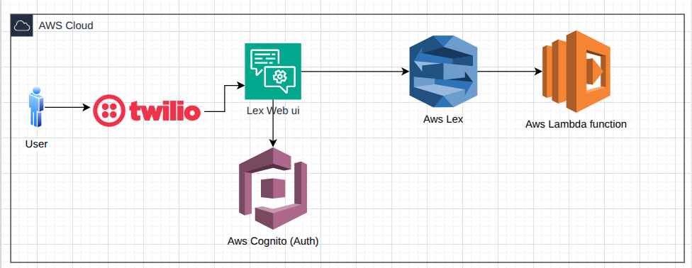

### Component Breakdown:

- **Amazon Lex**: Processes user inputs and manages conversation flow
- **AWS Lambda**: Validates user inputs and executes business logic
- **Amazon Cognito**: Handles user authentication and authorization
- **Lex Web UI**: Provides the web-based chat interface
- **Twilio** (Optional): Enables SMS and WhatsApp messaging channels

##  Prerequisites

Before starting, ensure you have:

- **AWS Account**
- **Node.js** version 18 or higher
- **npm** or **yarn** package manager
- **Twilio Account** (optional, for SMS/WhatsApp integration)

##  Setup Instructions

### 1. AWS Lex Bot Configuration

#### Step 1.1: Create the Lex Bot

1. Navigate to the [AWS Lex Console](https://console.aws.amazon.com/lexv2/)
2. Click **"Create bot"**
3. Configure the bot with these settings:
    - **Creation method**: Start with generative AI
    - **Bot name**: `ITHelpDeskBot`
    - **Description**: IT Help Desk support chatbot
    - **IAM role**: Check the option :  Create a role with basic Amazon Lex permissions
    - **Language**: English (US)
    - **Session timeout**: 5 minutes


#### Step 1.2: Define Intents

Create Many intents to handle different user requests:

**Example Intent 1: PasswordReset**
- **Purpose**: Handle password reset requests
  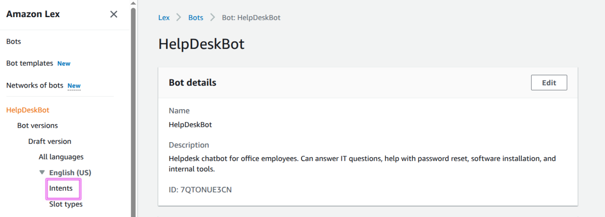
  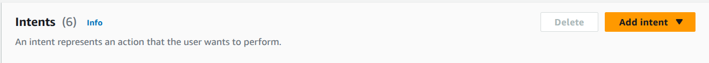
- **Sample utterances**:


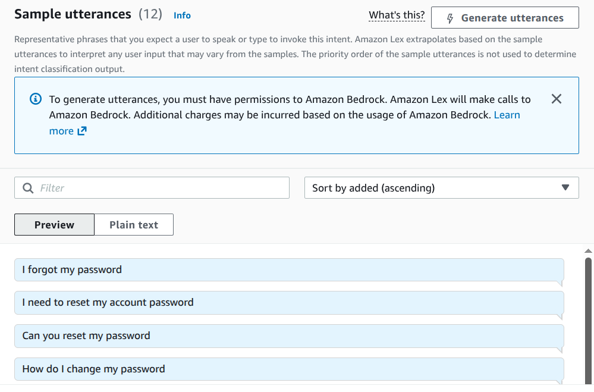
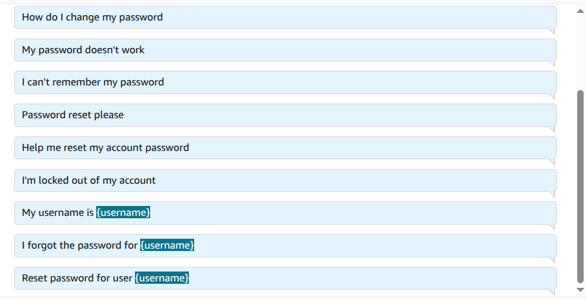

- **Slots**:
    - `username` (AMAZON.AlphaNumeric) - Required
    - `Email` (AMAZON.EmailAddress) - Required
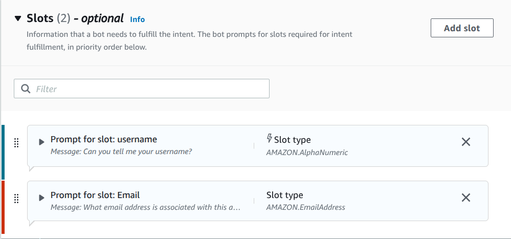
- **Closing response :**:
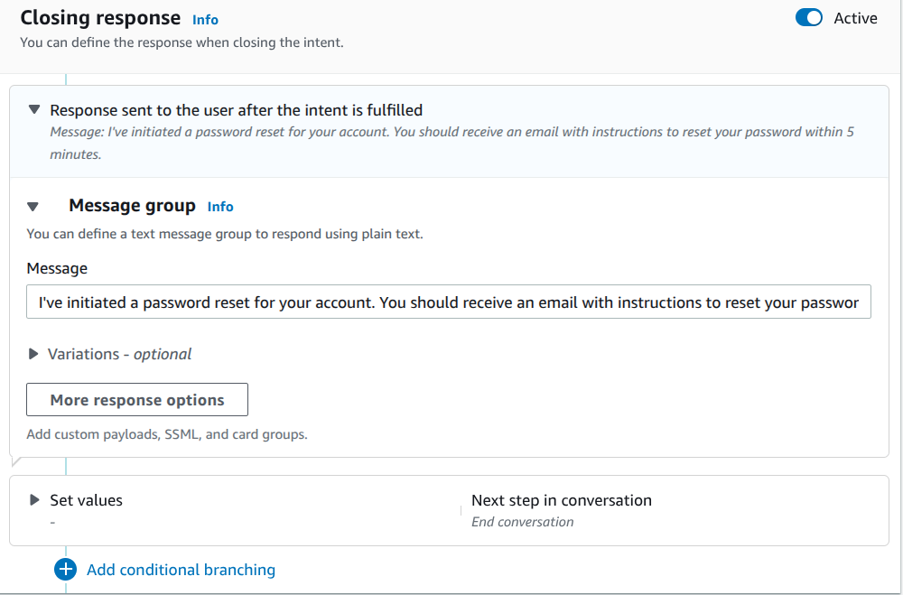
- **Build the Bot for testing :**

- **Testing**:
  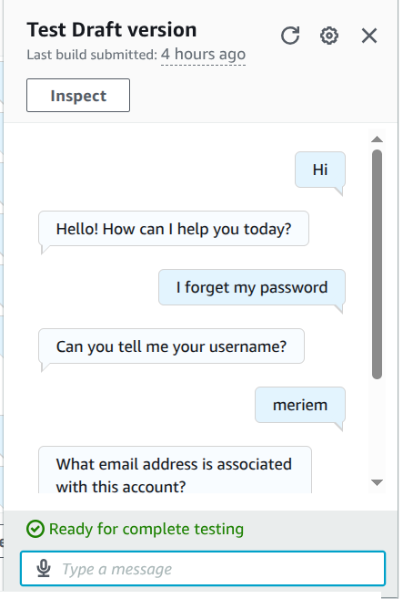
### 2. Lambda Function Setup

#### Step 2.1: Create the Lambda Function

1. Go to the [AWS Lambda Console](https://console.aws.amazon.com/lambda/)
2. Click **"Create function"**
3. Configure:
    - **Function name**: `ITHelpDeskBotHandler`
    - **Runtime**: Python 3.12
    - **Architecture**: x86_64
    - **Permissions**: Create a new role with basic Lambda permissions

#### Step 2.2: Add the Code

Replace the default code with the following:

```python
import json

def validate_slots(slots, intent_name):
    """
    Validates required slots for each intent.
    Returns validation status and prompts for missing information.
    """
    if intent_name == 'PasswordReset':
        if not slots.get('username'):
            return {
                'isValid': False,
                'violatedSlot': 'username',
                'message': "Can you tell me your username?"
            }
        if not slots.get('Email'):
            return {
                'isValid': False,
                'violatedSlot': 'Email',
                'message': "What email address is associated with this account?"
            }
    
    elif intent_name == 'NetworkIssue':
        if not slots.get('ConnectionType'):
            return {
                'isValid': False,
                'violatedSlot': 'ConnectionType',
                'message': "Are you trying to connect via WiFi, Ethernet, VPN, or Cellular?"
            }
    
    return {'isValid': True}

def lambda_handler(event, context):
    """
    Main handler for Lex bot events.
    Handles both dialog validation and fulfillment.
    """
    slots = event['sessionState']['intent'].get('slots', {})
    intent_name = event['sessionState']['intent']['name']
    source = event['invocationSource']
    
    # Dialog validation phase
    if source == 'DialogCodeHook':
        validation_result = validate_slots(slots, intent_name)
        
        if not validation_result['isValid']:
            # Request missing information
            return {
                "sessionState": {
                    "dialogAction": {
                        "type": "ElicitSlot",
                        "slotToElicit": validation_result['violatedSlot']
                    },
                    "intent": {
                        "name": intent_name,
                        "slots": slots
                    }
                },
                "messages": [
                    {
                        "contentType": "PlainText",
                        "content": validation_result['message']
                    }
                ]
            }
        else:
            # All slots valid - delegate to Lex
            return {
                "sessionState": {
                    "dialogAction": {"type": "Delegate"},
                    "intent": {
                        "name": intent_name,
                        "slots": slots
                    }
                }
            }
    
    # Fulfillment phase
    if source == 'FulfillmentCodeHook':
        responses = {
            'PasswordReset': "I've initiated a password reset for your account. Check your email for instructions within 5 minutes.",
            
            'NetworkIssue': "For {ConnectionType} issues, please restart your device. If it doesn't work, go to Settings > Network and reconnect. Still failing? Contact IT at ext. 5555.".format(
                ConnectionType=slots.get('ConnectionType', {}).get('value', {}).get('interpretedValue', 'your connection')
            ),
            
            'SoftwareInstallation': "Your software installation request has been logged. IT will assist you shortly.",
            
            'GeneralQuery': "Thank you for your question. We will provide an answer as soon as possible.",
            
            'SmallTalk': "Hello! How can I help you today?",
            
            'FallbackIntent': "I'm sorry, I didn't understand that. Can you rephrase?"
        }
        
        return {
            "sessionState": {
                "dialogAction": {"type": "Close"},
                "intent": {
                    "name": intent_name,
                    "slots": slots,
                    "state": "Fulfilled"
                }
            },
            "messages": [
                {
                    "contentType": "PlainText",
                    "content": responses.get(intent_name, "Thanks! Your request is processed.")
                }
            ]
        }
```

#### Step 2.3: Connect Lambda to Lex

1. Go back to your Lex bot
2. For each intent:
   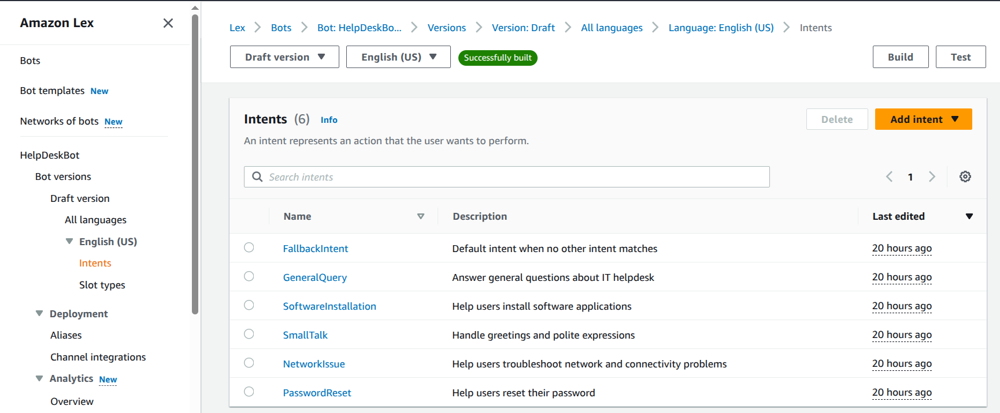
    - Navigate to **"Code hooks"**
     
    - Enable **"Use a Lambda function for initialization and validation"**
    -  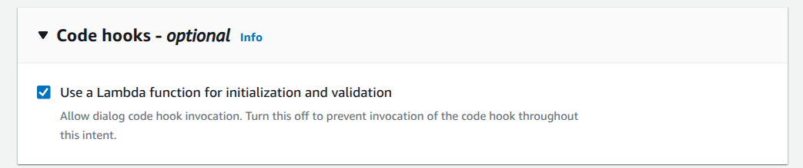 

3. **Build** the bot
4. Create a **Version** 
  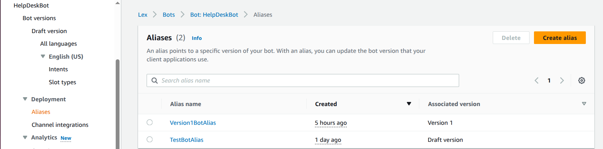
5. Create an **Alias** for that version 
6. In the alias settings:
    - Select **English** language
   
    - Choose your Lambda function
      

      
### 3. Amazon Cognito Authentication

#### Step 3.1: Create User Pool

1. Open [Amazon Cognito Console](https://console.aws.amazon.com/cognito/)


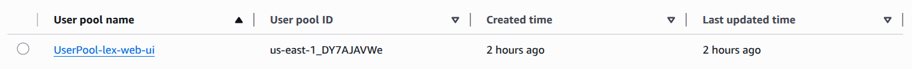

#### Step 3.2: Create Identity Pool

1. In Cognito, go to **"Identity pools"**
2. Click **"Create identity pool"**


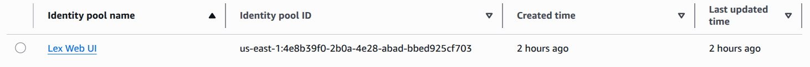

### 4. Twilio Integration (Optional)

This section enables SMS and WhatsApp messaging capabilities.

#### Step 4.1: Set Up Twilio Account


1. Sign up at [Twilio Console](https://console.twilio.com/)
   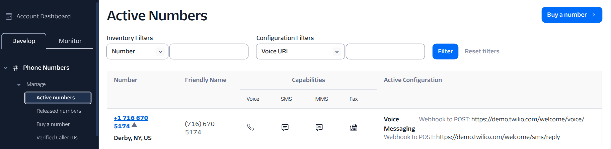
2. Get a Twilio phone number with SMS capabilities
3. 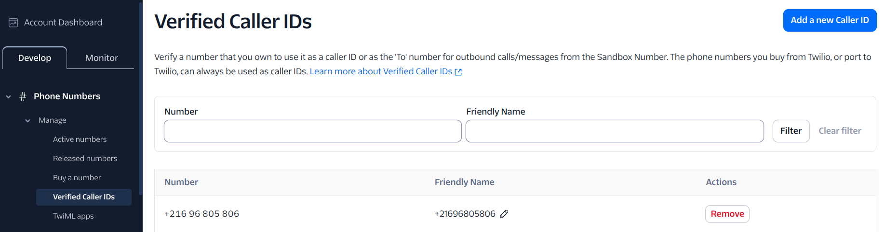
3. Note your **Account SID** and **Auth Token**


#### Step 4.3: Configure Lex Channel for Twilio

1. In your Lex bot, go to **"Channel integrations"**
2. Click **"Add channel"**
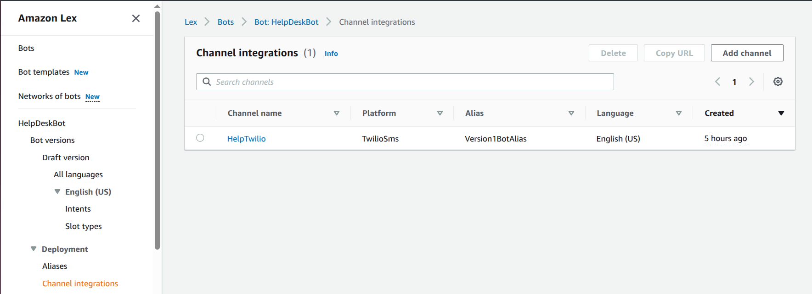
3. Select **"Twilio SMS"**
 
   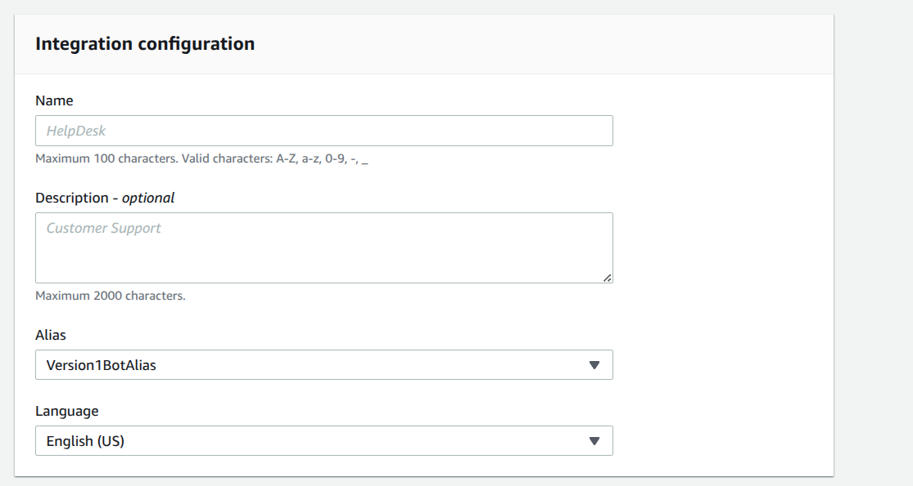
4. Enter your Twilio credentials:
    - Account SID
    - Auth Token

      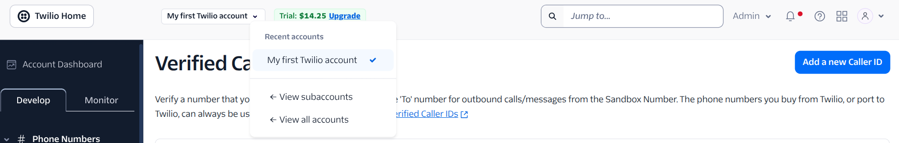
      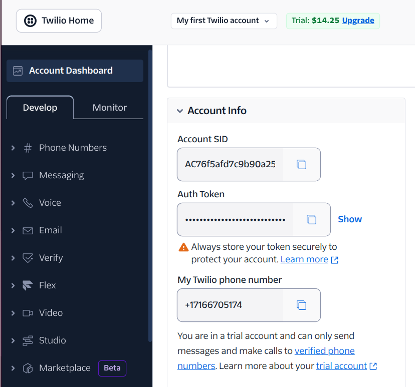
    - 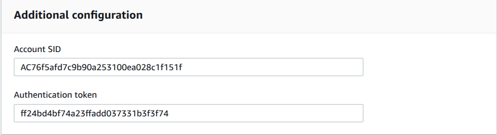
5. Copy the **Callback URL** provided by AWS

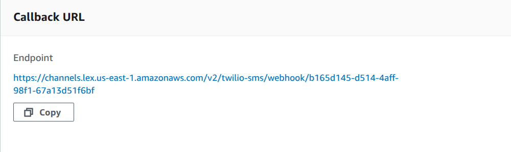


#### Step 4.4: Configure Twilio Webhook

1. In Twilio Console, select your phone number
2. Under **Messaging Configuration**:
    - Set **"A message comes in"** webhook to the Lex callback URL
    - Method: POST
      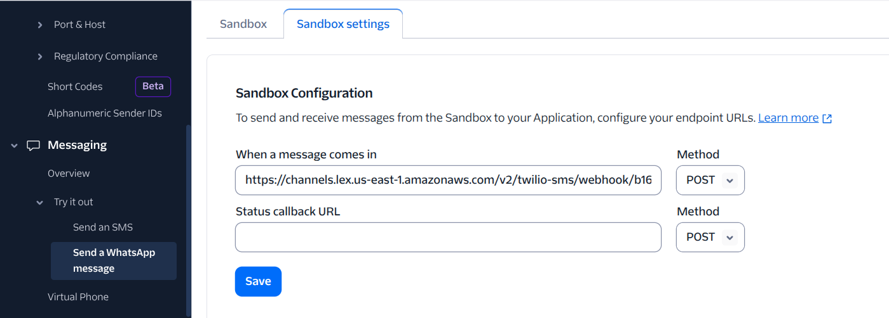
3. Save the configuration


#### Step 4.5: WhatsApp Integration (Optional)

1. In Twilio, navigate to **"Messaging" > "Try it out" > "Send a WhatsApp message"**
2. Follow the setup wizard to connect WhatsApp
   
3. Configure the WhatsApp webhook URL (same as SMS callback URL)
4. Send the join code to your WhatsApp Sandbox
   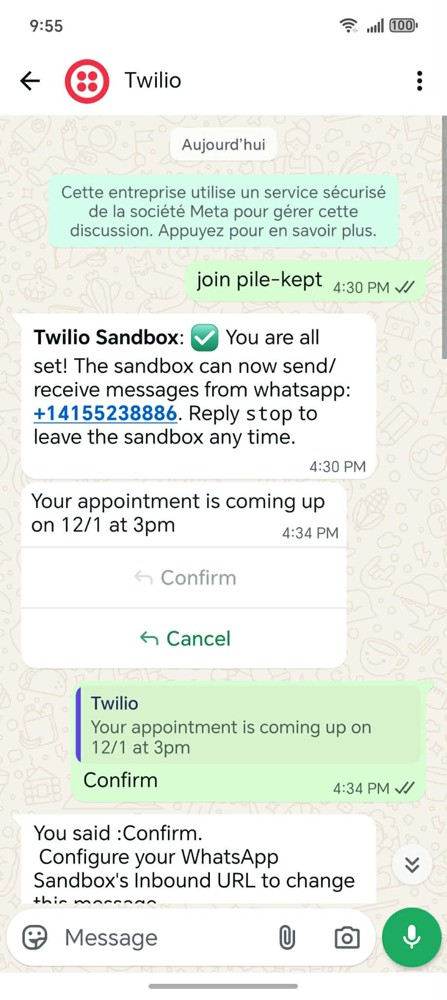

#### Step 4.6: Test the Integration

Send a test message to your Twilio number or WhatsApp:
- SMS: Text your Twilio number
- WhatsApp: Send a message after joining the sandbox

  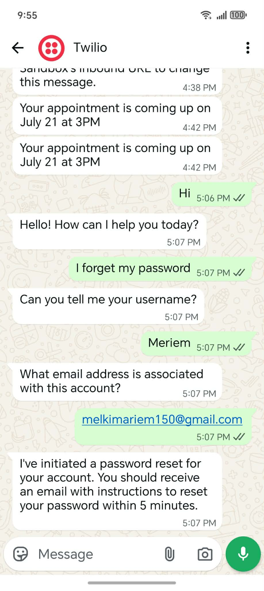

### 5. Lex Web UI Deployment

#### Step 5.1: Clone the Repository

```bash
git clone https://github.com/yourusername/cloud-based-lex-aws-chatbot.git
cd cloud-based-lex-aws-chatbot/lex-web-ui
```

#### Step 5.2: Install Dependencies

```bash
npm install
```

#### Step 5.3: Configure the Application

Edit the configuration file at:
`aws-lex-web-ui-master/lex-web-ui/src/config/config.dev.json`

```json
{
  "cognito": {
    "userPoolId": "us-east-1_XXXXXXXXX",
    "userPoolClientId": "XXXXXXXXXXXXXXXXXXXXXXXXXX",
    "identityPoolId": "us-east-1:XXXXXXXX-XXXX-XXXX-XXXX-XXXXXXXXXXXX",
    "region": "us-east-1"
  },
  "lex": {
    "botId": "XXXXXXXXXX",
    "botAliasId": "XXXXXXXXXX",
    "localeId": "en_US",
    "region": "us-east-1"
  },
  "ui": {
    "toolbarTitle": "IT Help Desk Bot",
    "toolbarLogo": "",
    "pageTitle": "IT Help Desk Support"
  }
}
```

Replace the placeholder values with your actual AWS resource IDs.


## 💻 Local Development

Run the application locally for testing:

```bash
npm run serve
```

The application will be available at `http://localhost:8080`

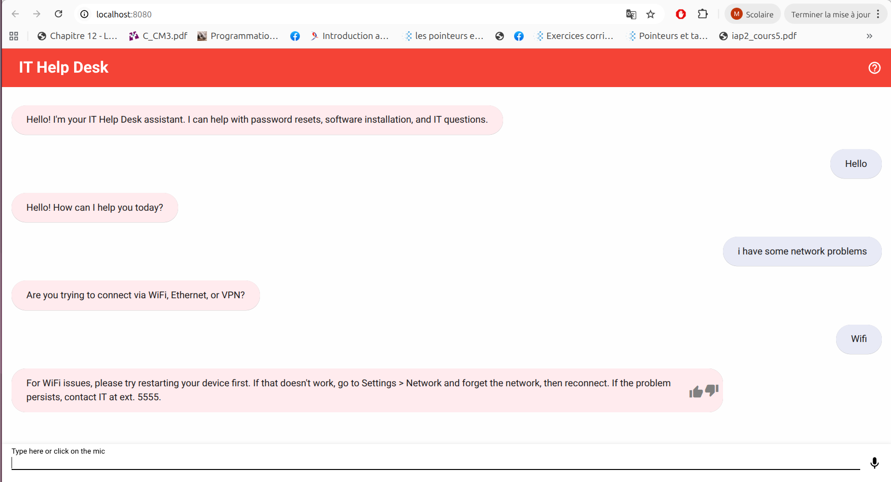

## 🌐 Deployment

### Deploy to S3 with CloudFront

1. Build the production bundle:
```bash
npm run build
```

2. Create an S3 bucket:
```bash
aws s3 mb s3://ithelpdesk-chatbot-ui
```

3. Enable static website hosting

4. Upload the build files:
```bash
aws s3 sync ./dist s3://ithelpdesk-chatbot-ui
```

5. Configure CloudFront for HTTPS access

